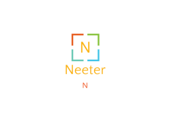
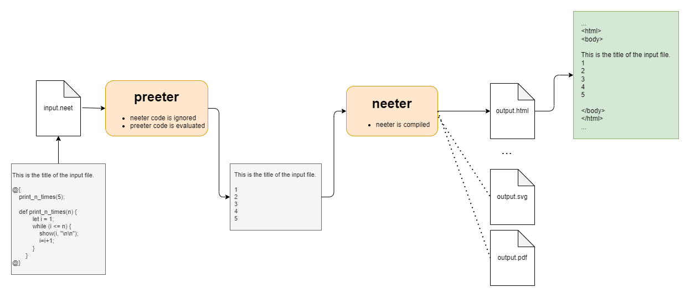

<h1 align="center"> Neeter </h1> <br>




## Spis treści
* [Neeter](#neeter)
* [Przykłady użycia](#przykłady-użycia)
* [Technologie](#technologie)
* [Zakres funkcjonalności](#zakres-funkcjonalności)
* [Uruchomienie](#uruchomienie)

## Neeter
Jest to język przeznaczony do formatowania tekstu. Został stworzony w celu uproszczonego tworzenia, formatowania tekstu i jego parametrów. Jako wyjście generwoany jest odpowiednio sforamtowany plik name.html. Środowisko jest tak przygotowane, że możemy zmienić format pliku wyjściowego i otrzymać `svg` lub `pdf`.
<br/>



## Przykłady użycia
Uruchamiając przykład z [example.neet](examples/example.neet) otrzymamy następny rezultat.
<br/>


## Technologie
- antlr-4.9.3-complete

## Zakres funkcjonalności
- scope na kod neeter
```
@{
  // code
@}
```

- zmienne (w tym zasięgi (scope) obowiązywania zmiennych)
```
let x = 5;
```

- typy zmiennych
   - string
   - int
   - boolean
  

- operacje arytmetyczne za zmiennych
```
let x = 5;
let y = (x + 5) % 2;
```

- instrukcje warunkowe
```
if (x % 2 == 0) {
    show("even", "\n\n");
}
else if ((i % 2) != 0) {
    show("odd", "\n\n");
} 
else {
    show("?", "\n\n");
}
```

- pętle
```
while (i < n) {
    // code
}
```

- funkcje (również rekurencyjne)
```
def helloNeeter(n, ...) {
    // code
}

helloNeeter(n, ...)
```

```
def fib(n) {
    if (n <= 1) {
        return n;
    }

    return fib(n - 1) + fib(n - 2);
}
```

- wbudowane funkcje
```
show();
```

- kolor tesktu
```

```

- formatowanie dla formuł matematycznych
```
{{x = 1 + 2 + 4 + ... + 128}}
```

- komunikaty o błędach


## Uruchomienie
#### Import
W celu edycji kodu żródłowego niezbędny będzie import kilku bibliotek.
1. ANTLR
    - Pobranie ANTLR (antlr-4.9.3-complete.jar) https://www.antlr.org/download/
    - Import biblioteki w Intellij ProjectStructure -> import ../antlr-4.9.3-complete.jar
    - Pobranie ANTLR plugin https://github.com/antlr/antlr4/blob/master/doc/getting-started.md
    - Import w Intellij Settings -> Plugins -> Install Plugin from Disk <br/><br/>

2. Ustawienie lokalizacji, w której będą generowane pliki języka <br/>
    <br/>
   

3. Generujemy pliki języka <br/>
   

4. Punkty 2 i 3 powtarzamy dla PreeterLexer.g4 i PreeterParser.g4

5. Uruchom program z argumentem "examples/example1.neet"

#### Uruchomienie
Uruchomienie pliku .jar z następującymi argumentami
- input - nazwa pliku z kodem w neeter
- watch (opcjonalnie) - obserwuje i kompiluje po każdej zmianie pliku wejściowego (widzimy rezultat w czasie rzeczywistym)
``` 
java -jar neeter.jar "path\input.neet" [-watch]
```
