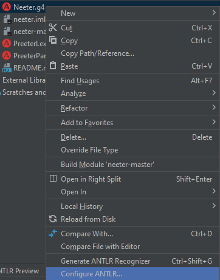
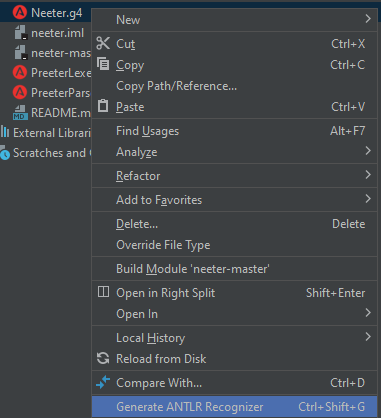

# NEETER
Jest to język przeznaczony do formatowania tekstu. Został stworzony w celu jak uproszczonego tworzenia, formatowania tekstu i jego parametrów.

## Technologie
- antlr-4.9.3-complete

## Przykłady użycia

## Zakres funkcjonalności
- zmienne (w tym zasięgi (scope) obowiązywania zmiennych)
- operacje arytmetyczne za zmiennych
- instrukcje warunkowe
- pętle
- funkcje (również rekurencyjne) 
- komunikaty o błędach 

## Uruchomienie
#### Import
W celu edycji kodu żródłowego niezbędny będzie import kilku bibliotek.
1. ANTLR
    - Pobranie ANTLR (antlr-4.9.3-complete.jar) https://www.antlr.org/download/
    - Import biblioteki w Intellij ProjectStructure -> import ../antlr-4.9.3-complete.jar
    - Pobranie ANTLR plugin https://github.com/antlr/antlr4/blob/master/doc/getting-started.md
    - Import w Intellij Settings -> Plugins -> Install Plugin from Disk   

2. Ustawienie lokalizacji, w której będą generowane pliki języka
   
   

3. Generujemy pliki języka  
   

4. Punkty 2 i 3 powtarzamy dla PreeterLexer.g4 i PreeterParser.g4

5. Uruchom program z argumentem "examples/example1.neet"

#### Uruchomienie
    Po wygenerowaniu pliku .jar (lub jego pobraniu)...
